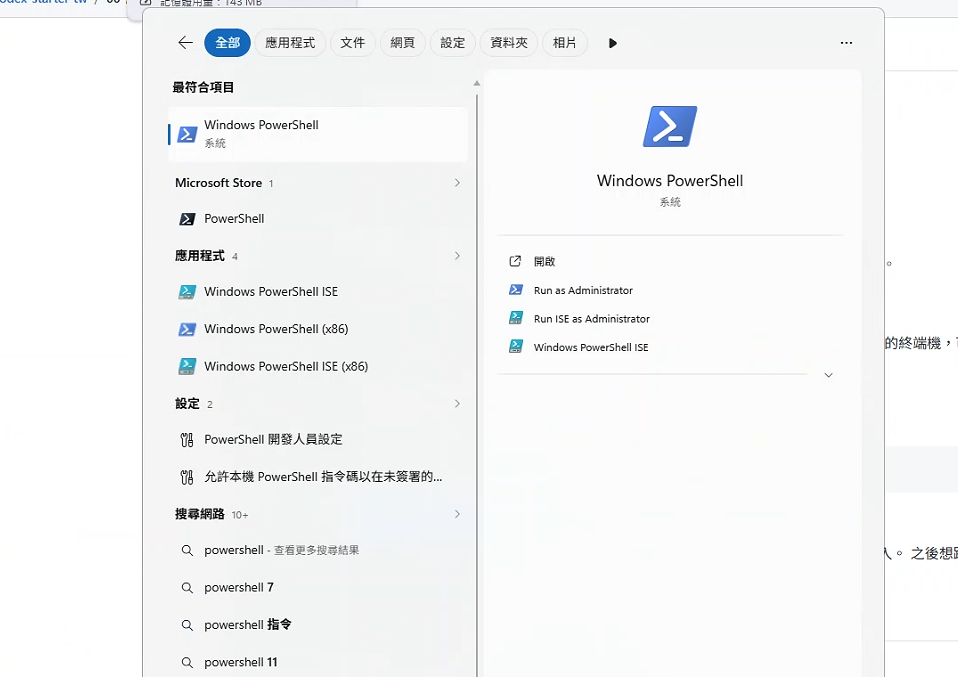

# 00 前置準備

開始前，確認下面幾件事。

## 0. ⚠️ 請用「自己的筆電」，不要用學校公務機
這堂課要安裝軟體。很多學校的公務機被資訊單位鎖住——**沒有安裝權限、防火牆擋下載或登入**——會在第一關就卡死。

- ✅ **請帶自己的筆電**（Windows 11），確認你平常可以自由安裝軟體。
- ❓ 不確定能不能裝？開始前先試裝一個小程式看看，能裝就沒問題。
- 🚧 真的只能用公務機、裝不起來：先**看老師示範**，把流程看懂；課後換自己的電腦再實作。

## 1. 你有付費 ChatGPT 帳號
Codex CLI 含在 ChatGPT 付費方案裡，**Plus（每月約 $20 美金）就能用，不必升到更貴的 Pro**。登入即用，不需要 API 金鑰、不會另外扣錢。
（免費帳號用量極少、基本上不夠跑這堂課，請先升級到 Plus。）

## 2. 你會打開「PowerShell」
這是 Windows 內建的終端機，等一下所有指令都打在這裡。

打開方式（任一種）：
- 按 **開始鍵**，輸入 `PowerShell` → 在「Windows PowerShell」上按右鍵 → **以系統管理員身分執行**。
- 或按 `Win + X` → 選「終端機（系統管理員）」。

> 安裝軟體那一步，請務必用「系統管理員」開，否則容易失敗。



### 選用：用 Warp 取代 PowerShell（更好看、更好用）

PowerShell 已經完全夠用，整堂課照 PowerShell 走就好。
如果你想要一個介面更現代、字大、好複製貼上的終端機，可以裝 **Warp**——一個免費的 AI 終端機，Codex 在裡面跑法一模一樣。

**安裝方式（二選一）：**

1. **指令安裝（最快）**：開 PowerShell，貼上這行：
   ```powershell
   winget install Warp.Warp
   ```
2. **官網下載**：到 https://www.warp.dev/download 下載 Windows 版，雙擊安裝。

裝好後從「開始」選單開啟 Warp，第一次要用 email 或 Google 帳號**註冊一個 Warp 帳號**（免費）才能進入。
之後想跑 Codex，就在 Warp 裡照常輸入 `codex` 即可，後面所有步驟通用。

**常用編輯快速鍵（Windows）：** Warp 的複製、全選跟一般軟體不太一樣，先記一下：

| 動作 | 按鍵 |
|---|---|
| 複製 | `Ctrl + Shift + C` |
| 貼上 | `Ctrl + V` |
| 全選 | `Ctrl + Shift + A` |
| 取代選取的字 | 用滑鼠選起來 → **直接打字就覆蓋掉** |
| 在畫面上搜尋 | `Ctrl + F` |

> 複製要多按一個 `Shift`，是因為終端機把單純的 `Ctrl + C` 留給「中斷指令」用。
>
> 嫌麻煩？打開 **`Settings → Features → Terminal` 裡的「Copy on select」**，之後**用滑鼠選取文字就自動複製**，連按鍵都免了，對新手最友善。想改快速鍵則到 `Settings → Keyboard shortcuts` 搜尋動作重新綁定。

## 3. 你有一個 GitHub 帳號
最後要把作品推上 GitHub。還沒有的話，先到 https://github.com 免費註冊（記住帳號和密碼）。
（這是進階關才會用到，現在沒有也能先開始上課。）

---

## 📖 先認識幾個詞（看不懂時翻回這裡查）

整堂課會一直出現這幾個詞，先有個印象就好，不用背：

| 詞 | 白話解釋 |
|---|---|
| **終端機 / PowerShell** | 一個用「打字下指令」操作電腦的視窗（通常黑底白字）。等一下大部分動作都在這裡打字。 |
| **指令** | 打給電腦看的一行命令，例如 `cd`、`codex`。本講義中**灰底的等寬字**通常就是要你照著打或貼上的指令。 |
| **資料夾（目錄）** | 就是平常裝檔案的那種夾子。Codex 一次只在「你指定的那個資料夾」裡工作。 |
| **路徑** | 檔案或資料夾「住在哪」的地址，像 `桌面 \ codex-練習`。 |
| **副檔名** | 檔名最後的 `.txt`、`.html`、`.md`，代表檔案類型——`.html` 是網頁、`.md` 是純文字筆記、`.txt` 是純文字。 |
| **Codex** | 這堂課的主角：一個住在終端機、聽你用**中文**講話、會幫你開檔／改檔的 AI 助手。 |

> 看到畫面跑出一大堆英文字不要怕——那多半是電腦的「進度報告」，不是出錯。只要沒有紅色的 `error`、或最後出現「完成」字樣，就是正常的。

---

準備好了就到 [01 安裝 Codex](../01-安裝Codex/)。
