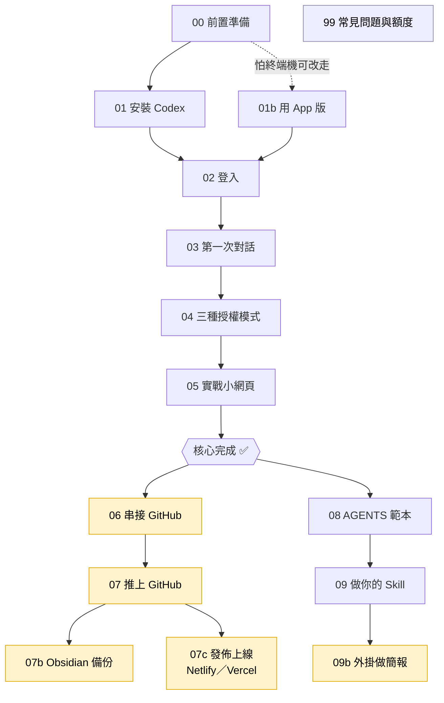

# Codex 新手入門（Windows 版）

> 三小時工作坊講義 ｜ 對象：完全沒寫過程式、會用電腦、有**付費 ChatGPT 帳號（Plus 即可）**的老師與一般人
> 講師：大乃老師（陳乃誠）

下課時你會：**裝好 Codex CLI → 親手用它做出三個小網頁 → 做一個自己的 Skill → 全部推上你的 GitHub。**

---

## 這份講義怎麼用

每個編號資料夾 = 一個步驟，照順序走就對了：

| 步驟 | 內容 |
|---|---|
| [00 前置準備](00-前置準備/) | PowerShell 怎麼開、要先有什麼帳號 |
| [01 安裝 Codex](01-安裝Codex/) | 裝 Node.js 與 Codex CLI（指令版） |
| [01b 用 App 版](01b-用App版/) ｜替代 | 怕終端機？改用視窗操作的 Codex App |
| [02 登入](02-登入/) | 用付費 ChatGPT 帳號登入 |
| [03 第一次對話](03-第一次對話/) | 在資料夾裡下第一個指令 |
| [04 三種授權模式](04-三種授權模式/) | 控制 Codex 能改什麼、跑什麼 |
| [05 實戰小網頁](05-實戰小網頁/) | 三個練習專案 |
| [06 串接 GitHub](06-串接GitHub/) ｜進階 | 把電腦跟 GitHub 綁定（推作品的前置） |
| [07 推上 GitHub](07-推上GitHub/) ｜進階 | 把成品變成你的作品集（時間不夠可當回家作業） |
| [07b Obsidian 備份](07b-Obsidian備份/) ｜應用 | 用剛學的 GitHub 技能備份 Obsidian 筆記 |
| [07c 發佈上線](07c-發佈上線/) ｜應用 | 用 Codex 外掛把網頁部署到 Netlify／Vercel、拿公開網址 |
| [08 AGENTS 範本](08-AGENTS範本/) | 給 Codex 的常駐指示 |
| [09 做你的 Skill](09-做你的Skill/) | 把常用指令變成一鍵技能（含兩個範例） |
| [09b 外掛做簡報](09b-外掛做簡報/) ｜應用 | 用 Presentations 外掛把文件自動變成 PPT |
| [99 常見問題與額度](99-常見問題與額度/) | 卡關排解 |

### 課程地圖



> **實線**＝主線，照順序走到「核心完成」就很棒了。
> 黃色的 **06 → 07 → 07b／07c** 是進階／應用支線（時間不夠可當回家作業）：**07b** 拿 GitHub 備份筆記、**07c** 用 Netlify／Vercel 把網頁部署上線；**99** 卡關時隨時查。
>
> 💸 好奇能不能用自己的 OpenAI API key？（本課不需要、而且會額外付費）見 [99 常見問題：改用 API key 嗎？](99-常見問題與額度/README.md#進階可以改用-api-key-嗎)

---

## 一鍵安裝（最快）

開 **PowerShell（系統管理員）**，貼上這一行按 Enter：

```powershell
irm https://raw.githubusercontent.com/hk6429/codex-starter-tw/main/scripts/install-win.ps1 | iex
```

它會自動幫你裝好 Node.js 與 Codex CLI。裝完跳到 [02 登入](02-登入/)。

> 不想用一鍵安裝、想一步步理解的人，請走 [01 安裝 Codex](01-安裝Codex/)。
>
> 想要更好看好用的終端機？可選裝 **Warp**（`winget install Warp.Warp`），Codex 在裡面跑法一樣。詳見 [00 前置準備](00-前置準備/)。

---

## 什麼是 Codex CLI？（30 秒理解）

- **ChatGPT 網頁**：你問、它答，答案停在瀏覽器裡。
- **Codex CLI**：住在你電腦的終端機，會**真的打開你的檔案、修改檔案、執行指令**，等於一個會動手的 AI 工程師助理。
- 費用：含在你的**付費 ChatGPT 訂閱**裡（Plus 即可，不必到 Pro），登入即用，不用另外辦 API 金鑰。

授權：本講義內容歡迎自由取用、改作於教學用途。
